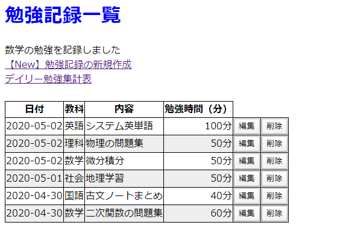
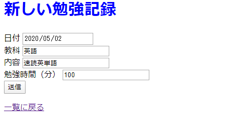
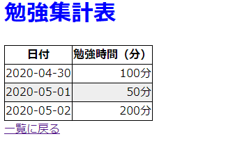

## Sinatra_Udemy(アプリ制作)
## 実施したこと
  1. 勉強時間を10分単位で増減できるようにする。  
  実施済み。http://www.htmq.com/html5/input_step.shtml　を参照

  2. 一覧を日付降順に並び変え。  
  実施済み。http://ihatov08.hatenablog.com/entry/2016/02/26/111447 を参照。

  3. subjectをリスト選択にする。（国語、数学、英語、社会、理科）  
  実施済み。http://www.htmq.com/html5/datalist.shtml を参照。

  4. dateには初めから今日の日付が入るようにする。  
  実施済み。

  5. バリデーションエラー文言の日本語化（ギブアップ）  
  色々調べて試したが、実装できなかった...  
  【実施した内容】  
  ①講義の内容から「i18n」が使える？と思いwebを検索。  
  ②色々調べてみてhttp://yuuxxxx.hatenablog.com/entry/2013/09/24/180411 を参考にgemのインストールを実施。
  ③「i18n」のディレクトリを用意して中に講座で使用したテキストを入れて保存したが、上手くいかず...

  6. 集計画面の作成  
  日付ごとの勉強時間集計には、以下の考え方で実装した。（多分色々とおかしいやり方な気がする...）  
  【考え方】
  ①`@sum_studytimes = Study.group("DATE(date)").sum(:studytime)`にて日付ごとに勉強時間を集計。  
  ②`@sum_studytimes`の中身には、「日付、日付ごと学習時間合計」が入っているため、以下サイト参考に取り出し。  
  https://rightgo09-ruby.hatenadiary.org/entry/20130301/p1

  7. 一覧画面から編集、削除ができるようにする。  
  progate学習をしたlink_toメソッドは使用できなかったので、以下サイトを参考にした。  
  http://sounanda.jp/itskillup/?p=805

  8. 画面を少しだけ整える。（こだわり過ぎない！）  
  完了

## アプリ完成画面
### 一覧画面

### 新規入力画面

### 一覧画面

