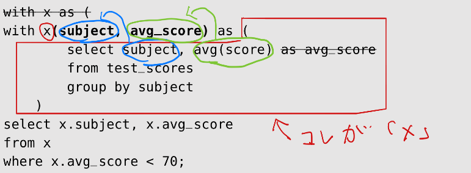

## わかりこみSQL（P.65~155）
- count(＊)とcount(項目名)の違いについて  
(項目名)は項目名の数を数えるため、nullの項目はcountの対象外となる。


- group byの仕組みについて  
  1. group by 句でグループ化される前は、行が操作対象
  2. group by 句でグループ化された後は、グループが操作対象  
  【具体例】  
  ```
  select gender, avg(height) ← 最後
  from members ← 1番目
  where height >= 165 ← 2番目
  group by gender ← 3番目
  having count(*) >= 2 ← 4番目
  order by gender ← 5番目
  limit 2 offset 0; ← 6番目
  ```
  上記の場合は、`where height >= 165`は行に対して、実行される。（165cm以上の行を選ぶ）  
  `having count(*) >= 2`、`order by gender`、`limit 2 offset 0`、`select gender, avg(height)`はグループに対して実行される。  
  【注意点】  
  select句、order by句に指定ができるのは、「グループ化のキー」と「集約関数」だけとなる。  
  上記例の場合だと、「グループ化のキー：gender」、「集約関数：avg(height) 」は使用可能。


- SQLでのnullの扱いについて  
nullとの計算式はどれもnullになる。（他の言語と異なりエラーも発生しない）  
値がnullかどうかを調べるには、「is null」と「is not null」を使用する。  
また値がnull だったら別の値に変換したいときは、coalesce() 関数を使う。


- サブクリエについて  
SQLを別のSQLの一部として使う機能。
| 単一列単一行         | 単一列複数行       | 複数列単一行         | Header Two                    |
|:---------------------|:-------------------|:---------------------|:------------------------------|
| 例）(10)             | 例）(10),(11),(12) | 例）(10,20,'A')      | 例） (10,20,'A') ,(30,40,'B') |
| 単一値のかわりに使う | in演算子で使う     | 複数値のかわりに使う | テーブルのかわりに使う        |


- existsについて  
サブクリエで指定した条件に合う行があるかどうか調べる。(true,falseを返す)  
inとexistsの違いが分からなくなったので、以下サイトを参考にした。（参考にしても分かったような、分からないような...）  
  [【参考サイト】in、existsの違い](https://qiita.com/darkimpact0626/items/5a5d03c27ae7c849566f)

- with句について  
with句を使用することでサブクリエにを使用することができる。文章だとわかりにくいので本に直接書き込み。

またサブクエリをwith句にすると、SQLの実行速度が遅くなることがなる。（SQLの最適化がwith句にはきかないため！）
