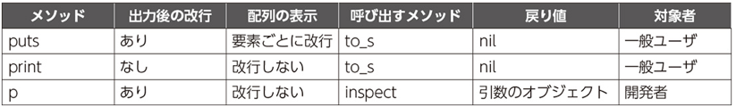

### Cherry_book(第2章途中~第3章)
- Rubyに関する基礎知識  
  1. &&、||での戻り値は、「true,false」になるとは限らず式全体の真偽が決まった際の最後に評価した式の値を返す。  
  例）1 && 2 && 3 >> 3を返す。  
  1 && nil && 3 >> nilを返す。（nilの時点で全体が偽と確定のため）  

  2. if文を条件演算式で書くこともできる。（複雑な条件文だと見づらくなるので注意！）  
  例）n > 10 ? '10より大きい' : '10以下'(10より大きいかどうかで表示を変える)  

  3. Rubyの変数にはオブジェクトそのものではなく、オブジェクトへの参照が格納されている。  
  例）以下の場合はbとcが同一のオブジェクトを参照している。(aとは同一文字だが異なるオブジェクト！)
  ```
  a = 'Hello'
  b = 'Hello'

  c = b
  ```

  4. puts,print,pメソッドの違い  
    
  
- テストの自動化  
  ```
  require 'minitest/autorun'
  require './lib/fizz_buzz'

  class FizzBuzzTest < Minitest::Test
    def test_fizz_buzz
      assert_equal '1', fizz_buzz(1)
      assert_equal '2', fizz_buzz(2)
      assert_equal 'Fizz', fizz_buzz(3)
      assert_equal '4', fizz_buzz(4)
      assert_equal 'Buzz', fizz_buzz(5)
      assert_equal 'Fizz', fizz_buzz(6)
      assert_equal 'Fizz Buzz', fizz_buzz(15)
    end
  end
  ``` 
上記のファイルを作成することでテストが実施できる。  
`assert_equal '期待する結果', 実施内容`という形式で書く。


- Rubyの繰り返し処理について  
他の言語では`for`文を使用するが、Rubyではeachメソッドを使用する。  
```
numbers.each do |n|
  sum += n
end
```
上記のdo...endまでがブロックと呼ばれる範囲となる。またnはブロック引数と呼ばれる。  
do...endは、{...}に書き換えることもできる。  


- ブロックを使う配列のメソッド
  1. mapメソッド  
  ブロックの戻り値が新しい配列の各要素になる。