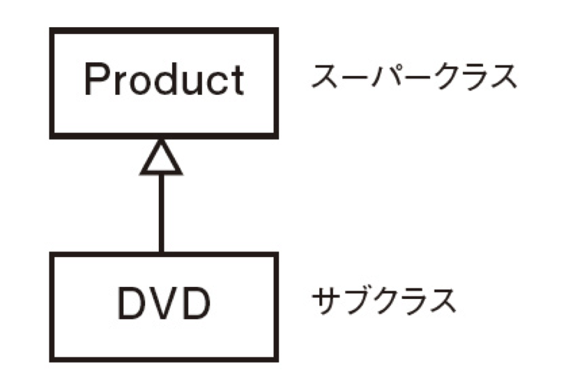

### Cherry_book(第7章途中~第8章途中)
- クラスの継承について  
  
継承を使いたい時は機能ではなく、性質や概念の共通点に着目をする。  
判断基準は、「サブクラス is a スーパクラス」と読んだ時に違和感がないこと。  
上記の例の場合だとDVD is a ProductとなるのOK。  

- メソッドの公開レベルについて(Java,C#とは違う！)  
  1. publicメソッド  
  クラスの外部からでも自由に呼び出しができるメソッド。（initializeメソッド以外のデフォルト）  

  2. privateメソッド  
  クラスの外からは呼び出すことができず、クラスの内部でのみ使えるメソッド。（サブクラスからの呼び出しは可能！）  
  ※厳密にいうとレシーバを指定して呼び出すことができないメソッド。そのため、クラス内部でもself月で呼び出すとエラーになる。  
  ※クラスメソッドはprivateの下に書くだけでは適用されないので注意。  

  3. protectedメソッド  
  レシーバー付きでメソッドを呼び出すことができる。  

- 定数について  
定数については`クラス名::定数名`にてクラスの外部から参照することができる。  
※定数はメソッド内部では作成することができないので、クラス構文の直下で作成する必要がある。  

- モジュールについて  
  1. モジュールからインスタンスを作成することはできない。  
  
  2. 他のモジュールやクラスを継承することができない。

  3. 継承は使えないが、共通の機能を持たせたい時に使う。