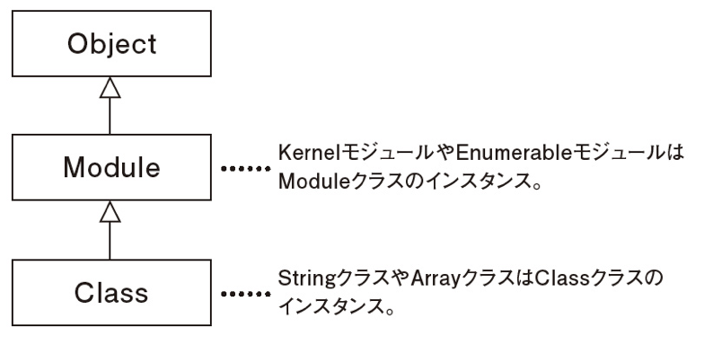

### Cherry_book(第8章途中~第11章途中)  
- モジュールを使えるようにする際のinclude,excludeの違い  
includeはインスタンスメソッドとなり、excludeはクラスメソッドとなる。  

- クラス、モジュールの継承関係  
  
上記図のようにclassを作る時点で継承されている。

- 機能共通化以外のモジュールの使用方法  
1. 「名前空間」を使用してクラス名の衝突を避ける機能。  
2. 関数や定数を提供する機能。  
3. 設定値などを保持する機能。  


- yieldについて  
メソッド内で`yield`を使うとメソッド呼び出しに紐付けたブロックを実行することができる。  
```
def greeting
  puts 'おはよう'
  yield ##ここにdo~endのブロック文が入る
  puts 'こんばんは’
end

grerting do
  puts 'こんにちは'
end
#=>おはよう
#こんにちは
#こんばんは
```


- procについて  
ブロックをオブジェクト化するためのクラス(何らかの処理を表す)。  
```
##hello_procというProcオブジェクトを作る。
hello_proc = Proc.new do
  'Hello!'
end

##Procオブジェクトを呼び出す
hello_proc.call #=>"Hello!"
```
