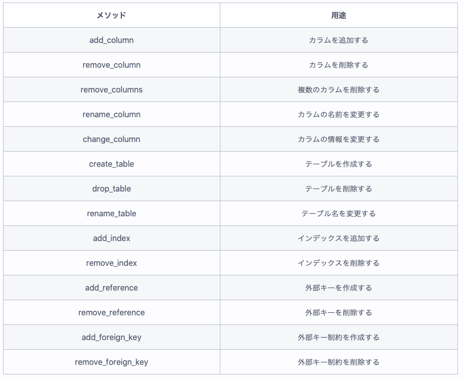

## 現場rails（P.167~171）
- `||=`について  
  current_userメソッド記載があったが、何これ？だったため以下に整理。[参考サイト](https://www.xmisao.com/2014/02/10/ruby-idiom-or-equal-operator.html)  
  【概要】  
  自己代入(total += 1)の一つらしい。機能は、左辺がnilまたはfalseなら代入をする。  
  【使用例】  
  ```
  irb(main):001:0> a = nil
  => nil
  irb(main):002:0> a ||= 5
  => 5
  irb(main):003:0> a ||= 100
  => 5
  ```

- マイグレーションファイルについて  
  マイグレーションファイルの書き方を以下に整理。[参考サイト](https://pikawaka.com/rails/migration)  

  【メソッド一覧】  
  

  【add_referenceメソッド】  
  ■使い方  
  ```
  add_reference  :テーブル名,  :リファレンス名 [, オプション]
  # （例）hogesテーブルに外部キーであるuser_idカラムを作成
  add_reference  :hoges,  :user
  ```

  ■注意点  
  ・外部キー制約のカラム名を「user_id」の様に「参照先のモデル名(小文字) 」+ 「_id」の形式だと外部キーだと認識される。（違う名前の形式で外部キーに名前をつける場合は、foreign_keyオプションで明示的に宣言する必要がある）  
  ・1対多の関係の時には、「多」の方に外部キーを作成する。（わかりこみSQLのP,199）  
  ・アソシエーションを定義するためには、1対多の「1」の方に`has_many :複数形のモデル名`、「多」の方に`belong_to :単数形のモデル名`を書く必要がある。  

  【change,up,downの使いわけ】  
  可逆的な処理であれば、`change`のみで定義ができるが、不可逆的な処理の場合は、`up`、`douwn`の両方を定義する必要がある。  
  ```
  def change
    # text型からstring型へ変更
    change_column :hoges, :name, :string
  end
  ```
  上記の例の場合は、ロールバックする前はtext型であったという情報が書かれていないため、以下のように記載する必要がある。  
  ```
  def up
    # text型からstring型へ変更
    change_column :hoges, :name, :string
  end

  def down
    # string型からtext型へ戻す
    change_column :hoges, :name, :text
  end
  ```