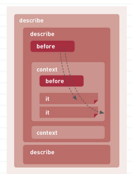

## 現場rails（P.172~200）
- テストについて  
1. RSpec(アールスペック)  
BDD(先に仕様書かつテストを作り、その後コードを書いていく手法)のためのテスティングフレームワーク。他のフレームワークとして、チェリー本で実施をした`Minitest`がある。  

2. Capybara(カピバラ)  
実際にユーザーがそのWebアプリケーションを使用しているかのように、様々なページを遷移しその際にどこか不具合がないか調べることができる。

3. FactoryBot(ファクトリーボット)  
データ(モデルインスタンス)生成のためのライブラリ。  

- Specの記載方法図  
以下のようにネストで記載をする。  
  

