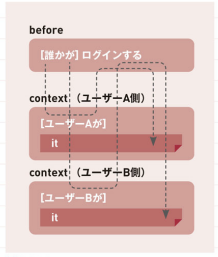

## 現場rails（P.201~215）  
- letを使用した共通化について  
  ■概要  
  ログインするユーザーが違うだけなどの共通ロジックのテストについては、共通部分を1つ上の階層の`before`の中に書いて共通化することができる。固有の部分については、`let`を利用する。  

  ■イメージ図  
  

  ■letの使用方法  
  let(定義名){ 定義の内容 }  

  ■注意点  
  ・定義する前にも使うことができる。  
  ・呼び出されたタイミングで実行されるため、定義するだけでは意味がない。(let!を使えば定義した時点で実行される)  

- miketaさんのレビュー会で学んだこと  
1. パーシャルを使う際の注意点  
パーシャル内では、インスタンス変数は使用せず、ローカル変数を使用した方が良い。`reder partial: 'form', locals:{ task: @task }`のようにパーシャルを呼ぶ際にインスタンス変数をローカル変数に渡す。(現場railsのP,119)  

2. scopeについて  
    ■そもそもscopeとは(現場RailsのP,178)  
    複数のクエリをまとめたメソッドを定義することができる機能。  

    ■scopeの使い方  
    モデルでscopeを定義をしてコントローラーではなるべく見やすく記載した方が良いらしい。[参考サイト](https://qiita.com/ozin/items/24d1b220a002004a6351)  

    ■難しく感じた箇所  
    上記の参考サイトにものっていたが、scopeで定義する範囲を決めるのが難しいと感じた。(コントローラーを簡潔にするため、無駄にscopeを定義して逆にわかりにくくしてしまいそう...)

3. destroyアクションでは`destroy!`メソッドを使う  

4. enumについて  
モデルの数値カラムに対して文字列による名前をつけることがきる。また、データ操作用の便利なメソッドが使用できるようになる。[参考サイト](https://qiita.com/ozackiee/items/17b91e26fad58e147f2e)