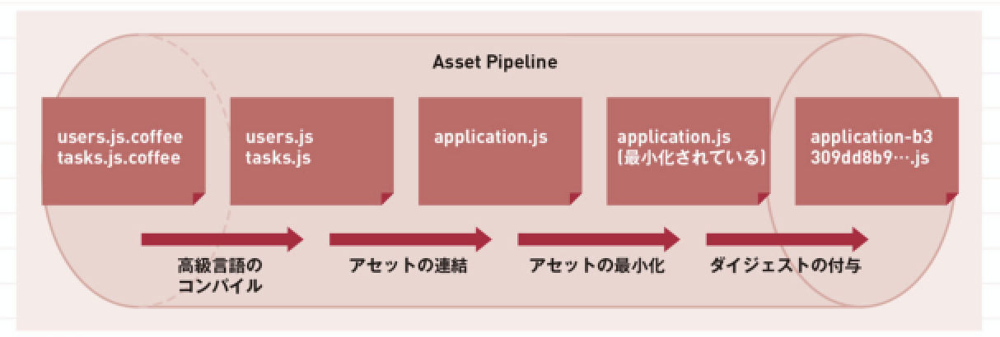
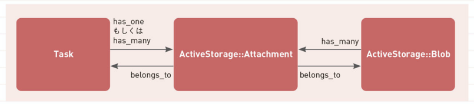

## 現場rails（P.261~338）  
- アセットパイプラインについて  
  ■概要  
  JS,css,画像などのリソース(アセット)を効率よく使用をするための仕組み。以下の図のようにファイルを統一したり、圧縮を行っている。  
    

  ■使い方  
  デフォルトではcss,JSをそれぞれ1つのファイルに連結するが、マニュフェストファイルに記述をすることで自由に変えることができる。  

- ファイルのアップロード機能について  
  ■概要  
  1.Active Storage(Rails標準)を使用。  
  2.クラウドストレージサービスへアップロード。  
  3.DB上でActiveRecordモデルに紐付けをする。  
  

## yukiさんのポートフォリオ会  
- Heroku 
Herokuは無料プランだとサーバーが落ちるため、そのタイミングで画像などが落ちてしまうためにAWS（S3）などに外出しをする必要がある。

- credentialsの概念について  
他の人にバレてはいけない取得情報を管理するものである。少し前の方法だと環境変数に設定をしていた。  
取得情報が管理された`credentials.yml.enc`は暗号化されてgit管理されている。`mater.key`で複合化できるので、`mater.key`を共有することにより、取得情報の共有ができる。

- references型について  
外部キーにしたい場合は、references型で定義をした方が良い。外部キー制約がつく。（リファレンス先に存在しないID登録を防ぐことなど）  

- helper_method :current_userを定義している理由  
view側でも`current_user`を使用したいために定義する必要がある。

- find_byを使う理由  
findにすると見つかららないと例外になるが、find_byはnilを返す。（sessionなどで見つからない可能性があるところで使う。）