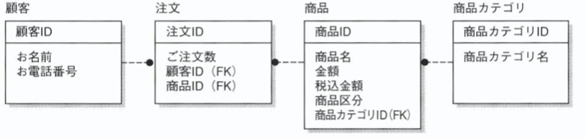

## 楽々ERDレッスン（P.1~）  
- そもそも正規化とは？  
重複を排除したDBを作成すること。  

- 正規化の手順  
0. 正規化をする前(項目を単純列挙)の表  
  

1. 繰り返し項目の削除  
商品1、2~などが発生しないように繰り返しの部分を切り出す。  
  

2. さらに各項目に注目をして重複を切り出す。(「顧客」、「商品」に重複がある)  
  

3. 「単価」は「商品」に紐付いているので、くっつける。（従属性という）  
  

4. 他の項目から計算等が可能な項目を排除する。（今回ケースだと「合計」は「明細」の合計で計算でき、「明細」は「単価」×「数量」で計算ができる。）  
  

5. 最後にテーブル間の紐付けを行うが、その際に既存の項目（実際の商品名）などを使用してしまうと変更に弱くなってしまうので、IDを定義する。  
【IDの関連付け】  
  
【ERDでの表現】  
  

- エンティティの見出し方  
  ■そもそもエンティティとは？？  
  何かの集合のこと（例えば学校のクラスなど）  

  ■エンティティの候補  
  以下の候補の中から「記録」したいものに注目をして作成する。  
    

- キーとコードの違いについて  
  コードはビジネス都合で命名された「あだ名」のようなもの。そのため、ビジネス都合で変更されたり、一意で無くなったりする。なので、キーと同一視するのは危険。なので別途IDを振った方が良い。  

- 物理設計について  
昔は「コンピュータの都合に合わせて非正規化すること」であったが、現在では「インデックスを設計すること」である。  

- データベース設計の手順  
1. 核となるイベントを見つけ出す  
その業務で一番核となる「〜する」というイベントは何か見つける。（「〜日」と言い方ができるかも判断基準になる。注文日など）  
【例注文表の場合】  
「注文する」が該当する。  

2. リソースを抜き出す  
「誰が」、「何を」に注目をして、リソースは何かを見つける。「〜名」と言い方ができるかも判断基準になる。顧客名など）  
【注文表の場合】  
「誰が」→「顧客が」、「何を」→「商品を」となる。  

3. 項目を入れていく  
上記で箱が用意出来たら項目を入れていく。  
【注文表の場合】  
■顧客テーブル  
お名前  
お電話番号  
■注文テーブル  
ご注文数  
■商品テーブル  
商品名  
金額  
税込金額  
商品区分  
上記テーブルに追加で複数の商品をグループ化しているので、商品カテゴリを表すテーブルを追加する。  
■商品カテゴリーテーブル  
商品カテゴリ名  

4. それぞれのテーブルにIDを設定する  
主キーに意味を持たせてしまうとその項目が変更された際にこまるので、「テーブル名+ID」を設定する。  
【注文表の場合】  
  

5. リレーションシップを設定する  
1対多の「多」側に外部キーを設定する。  
  
※1回の注文で1商品しか頼めない前提っぽい

- レシートのように内訳の記載がある場合  
1回の注文を表す部分と内訳を表す部分の2つのテーブルで表現する。  
【ERD】  

- セット商品と単品商品がある場合  
セット商品と単品商品は横並びの関係かつセット商品はそのものが存在しているのではなく複数の商品に「単品としての」名前を付与しているので以下の形式で表現する。  
【ERD】  
  