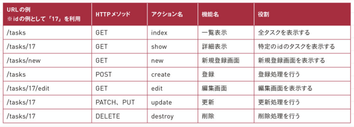
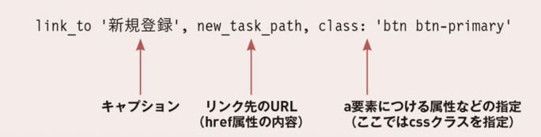

## 現場rails（P.68~104）
- Railsでのコードの通り道について  
シナトラの動画でも見た内容だが、以下に改めて整理。  
  1. まずメソッドと名前に対応するコントローラーが呼ばれ、モデルとビューの制御を行う。  
  2. DBと通信が必要な場合には、モデルによりやりとりを行う。  
  3. 画面表示については、ビューに記載をされる。 

- ヘルパーメソッドについて  
ビューで利用できる便利なメソッドのこと。（自分でも定義できる！）  

- テンプレートエンジンについて  
動的なHTMLを効率よく記述するための仕組み。以下のようなerb以外にも種類があるらしい。（初めて知った！！）  
```
#erbで記述
<html>
  <body>
    <h1><%= @title %></h1>
    <p>テスト</p>
  </body>
</html>
```
```
#Hamlで記述
%html
  %body
    %h1 = @title
    %p テスト
```
```
#Slimで記述
html
  body
    h1 = @title
    p テスト
```

- Bootstrapについて  
これを入れておくとレスポンシブデザインのを手軽にかけるらしい。（ツイッター社が作成）  

- Sassについて  
CSSより効率的に書けるようにした言語らしい。その中でも書き方が2種類ある。[Qiita参考記事](https://qiita.com/m0nch1/items/b01c966dd2273e3f6abe)
  1. SASS記法  
  rubyに似ている記載方法。インデントで依存関係を示す。  
  2. SCSS記法（本書はこちら採用）  
  CSSの書き方で記載をしてもエラーにならず使用が可能。  

- 基本的なCRUD機能の対応表  
  

- link_toメソッド  
  

- form_withメソッド  
フォームを作ることができるヘルパーメソッド。  
なんで繰り返しではないのにブロックを使うんだ？？と思っていたが、そもそもブロックは必ずしも繰り返しを表すものではない。（チェリー本の9.6.2にもファイル操作の例で記載あり）form_withメソッドの場合は、ブロック内`FORMタグ`で囲まれることを表す。[【参考】teratail](https://teratail.com/questions/141299)