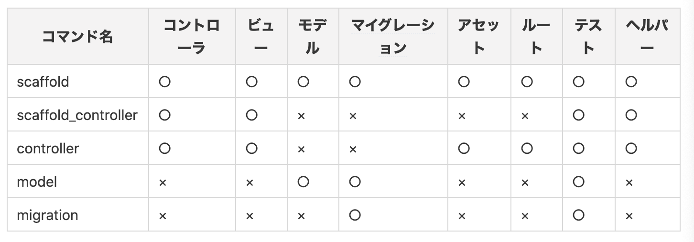

## 現場rails（アプリ制作中）  
### ざっくりとしたissue(適宜修正)  
    【環境構築】  
    1.プロジェクトのディレクトリでrails newで雛形を作成する。(バージョンに注意)(済)  
    2.slim,BootStrap,エラーの日本語化、better_errorsを導入。(済)  
    3.プロジェクトのディレクトリでgit initをする。(済)  
    4.リモートリポジトリを登録する。(済)  
    5.githubでissueを設定。(済)  

    【githubでのissue】  
    1.Expenceモデルを作成。（ID、名称、詳しい説明、登録日時、更新日時）(済)  
    2.新規登録、一覧表示機能を実装。（済）  
    3.詳細表示、編集機能、削除機能の実装。  
    4.データ内容の制限をする。  
    5.ログイン、ログアウト機能の実装。  
    ※admin:baseクラスを作り、管理者画面を変更する。  
    6.リレーションの設定する。  
    7.新しい順への並び替え、タイムゾーンの日本時間化をする。  
    8.検索機能の追加(名称、item(リスト))  
    9.ページネーションの実施  

### アウトプットでのメモ  
- generateコマンドで生成されるものについて  
scaffoldは、「model + controller」の機能。(ルーティングは異なる)[参考サイト](https://maeharin.hatenablog.com/entry/20130212/rails_generate)

- link_toメソッドを使う意味について  
aタグを使えばいいのでは？と思ったため、link_toメソッドのメリットを少しだけ調べた。[参考サイト](https://teratail.com/questions/28374)  
【メリット】  
  1.モデル・コントローラー内のリンク切れの心配を減らせる。  
  2.オプションが使える。(非同期通信など)  
  3.確認画面を出せる。  

- ストロングパラメーターについて  
ストロングパラメーターを用いた値の取り出し方法を少し調べた。[参考サイト](https://pikawaka.com/rails/permit)  

  1.form_withなどで送信してきた通信は、二次元ハッシュの構造になっているため、`params.require(:モデル名)`で値を取り出すことができる。  

  2.ただこの取り出し方だと検証モードなど他の項目を勝手に付け足すことができてしまう。  

  3.そこで`params.require(:モデル名).permit(:キー名)`とすることにより勝手な項目付け足しを防ぐことができる。