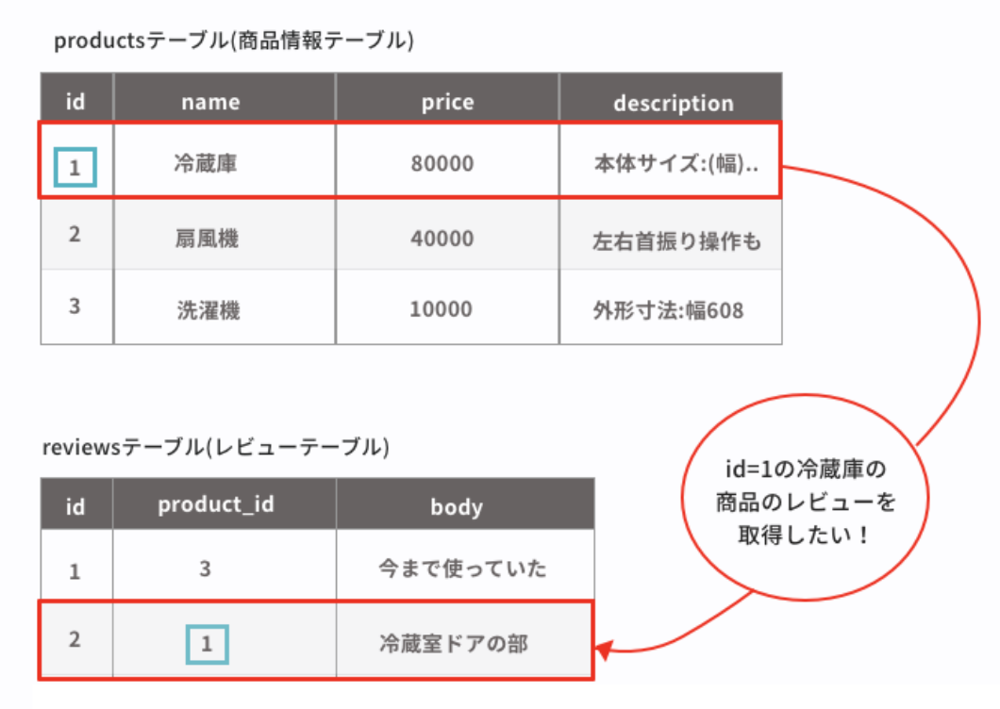

## 現場rails（アプリ制作中）  
### ざっくりとしたissue(適宜修正)  
    【環境構築】  
    1.プロジェクトのディレクトリでrails newで雛形を作成する。(バージョンに注意)(済)  
    2.slim,BootStrap,エラーの日本語化、better_errorsを導入。(済)  
    3.プロジェクトのディレクトリでgit initをする。(済)  
    4.リモートリポジトリを登録する。(済)  
    5.githubでissueを設定。(済)  

    【githubでのissue】  
    1.Expenceモデルを作成。（ID、名称、詳しい説明、登録日時、更新日時）(済)  
    2.新規登録、一覧表示機能を実装。(済)  
    3.詳細表示、編集機能、削除機能の実装。（済）  
    4.データ内容の制限をする。（済）  
    5.ログイン、ログアウト機能の実装。（済）  
    ※admin:baseクラスを作り、管理者画面を変更する。（済）  
    6.リレーションの設定する。  
    7.新しい順への並び替え、タイムゾーンの日本時間化をする。  
    8.検索機能の追加(名称、item(リスト))  
    9.ページネーションの実施  


### アウトプットでのメモ  
#### Chromeの検証機能について  
slimで記載したコードのhtmlとhttp通信を確認したいので、検証機能の使い方を少し調べた。  
  
  ■参考サイト  
  [参考サイト1](https://qiita.com/d-dai/items/0b580b26bb1d1622eb46)、[参考サイト2](https://www.buildinsider.net/web/chromedevtools/01)  

  ■各機能  
  1.Elements  
  生成させれたhtml,cssを確認できる。(タブルクリックで内容を修正することも可能)  

  2.Console  
  表示しているページのエラー、警告、情報を確認できる。(JavaScriptのテストを書くこともできるらしい)  

  3.Network  
  JSや画像などのページを開いた際に行われた通信を確認できる。  

  4.その他の機能  
  左上のデバイスマークをクリックするとスマホでの見方をかくにんすることができる。


#### アソシエーションについて(1対多)  
  ■参考サイト  
  [Pikawaka](https://pikawaka.com/rails/association)、[Hatena Blog](https://sakurawi.hateblo.jp/entry/2017/09/09/%E3%80%90RubyonRails%E3%80%91new%E3%81%A8build%E3%81%AE%E9%81%95%E3%81%84%E3%81%AB%E3%81%A4%E3%81%84%E3%81%A6%E3%80%90alias%E3%80%91)  

  ■そもそもアソシエーションとは？？  
  テーブル同士が外部キーなどを利用して紐付けが行われている場合、モデル上の関係として操作出来るようにする仕組み。  

  ■アソシエーション用いたDB取得方法例  
  1.前提のテーブル  
    

  2.アソシエーションを使用しない場合の取得方法  
  ```
  # まずproductsテーブルから該当レコードを検索。取得をしたIDよりreviewテーブルに対してwhere文を使用して取得。
  @product = Product.find(1)
  @reviews = Review.where(product_id: @product.id)
  ```

  3.アソシエーションを使用する場合の取得方法  
  ```
  # 以下のようにwhereを使用せずに取得することができる。
  @product = Product.find(1)
  @reviews = @product.reviews
  ```

  ■アソシエーション用いたDB登録方法例  
  1側のインスタンス.多側のモデル名(複数形).new で外部キーの設定ができる。(newの後に引数設定で多側のDBに他の情報登録が可能)
  ```
  irb(main):001:0> @user = User.first
  User Load (0.3ms)  SELECT  "users".* FROM "users" ORDER BY "users"."id" ASC LIMIT $1  [["LIMIT", 1]]
=> #<User id: 2, name: "admin", email: "admin@admin", password_digest: "$2a$12$0dvqpHKdg8mEeRP1Bw/uguK16yFej1B0zQNWqFu0AJY...", created_at: "2020-07-09 11:46:39", updated_at: "2020-07-09 11:46:39", admin: false>
irb(main):002:0> @expence = @user.expences.new
=> #<Expence id: nil, name: nil, amount: nil, description: nil, created_at: nil, updated_at: nil, user_id: 2>
irb(main):003:0> @expence = @user.expences.new(amount: 5000)
=> #<Expence id: nil, name: nil, amount: 5000, description: nil, created_at: nil, updated_at: nil, user_id: 2>
```