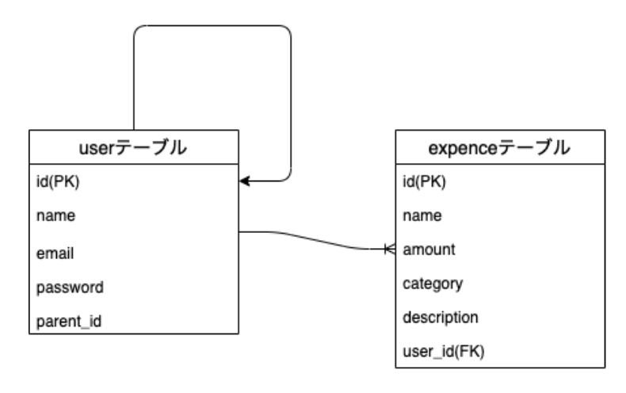

## 現場rails（アプリ制作中）  
### ざっくりとしたissue(適宜修正)  
    【環境構築】  
    1.プロジェクトのディレクトリでrails newで雛形を作成する。(バージョンに注意)(済)  
    2.slim,BootStrap,エラーの日本語化、better_errorsを導入。(済)  
    3.プロジェクトのディレクトリでgit initをする。(済)  
    4.リモートリポジトリを登録する。(済)  
    5.githubでissueを設定。(済)  

    【githubでのissue】  
    1.Expenceモデルを作成。（ID、名称、詳しい説明、登録日時、更新日時）(済)  
    2.新規登録、一覧表示機能を実装。(済)  
    3.詳細表示、編集機能、削除機能の実装。（済）  
    4.データ内容の制限をする。（済）  
    5.ログイン、ログアウト機能の実装。（済）  
    ※admin:baseクラスを作り、管理者画面を変更する。（済）  
    6.リレーションの設定する。（済）  
    7.タイムゾーンの日本時間化をする。（済）  
    8.検索機能の追加(子供の名前)、ページネーションの実施   


### アウトプットでのメモ  
#### DBの結合について  
■前提  
【ER図】  
  

【前提条件】  
1.userテーブルには、親権者アカウントと子供アカウントが登録される。  
2.親権者アカウントから子供アカウントの作成をする。  
（子供アカウントには親権者アカウントのidがparent_idに保管される）  
3.子供アカウントからのみ支出(expence)を登録することができる。  
4.親権者アカウントからは自身が作成した子供アカウントの支出(expence)を表示することができる。  

■上手くいかなかった事項  
親権者アカウントから子供アカウントの支出を表示させるために以下のように記載をしていたが、問題点があった。  
【expences_controller.rbのindexアクション】
```
# parent_userは、ログイン中の親権者アカウントを取得するヘルパーメソッド
# self_children(自身の複数の子供)からeach文でself_child(自身の単数の子供)の支出を@expences入れていた。
def index
  if parent_user
    self_children = parent_user.children
    @expences = []
    self_children.each do |self_child|
      @expences.concat(self_child.expences)
    end
  else
    @expences = child_user.expences
  end
end
```

【問題点】  
@expencesが配列のクラスなってしまうため、ransackが上手く使えなかった。  
（それ以前にこのような書き方はしない気がする）

■解消方法  
【参考サイト・動画】  
[Rails における内部結合、外部結合まとめ(Quita)](https://qiita.com/yuyasat/items/c2ad37b5a24a58ee3d30)  
[SQL素人でも分かるテーブル結合(inner joinとouter join)(Quita)](https://qiita.com/naoki_mochizuki/items/3fda1ad6594c11d7b43c)  
[質問会の動画(55分〜)](https://drive.google.com/file/d/1ob9UopmwKUFgcbQ7tmsCo2XCaGstL6z1/view)  

【回答】  
`Expence.joins(:user).where(users: { parent_id: parent_user.id }`と記載をするとeach文不要かつ問題点も解消される。  

【考え方（自分なりに整理）】  
①前半部分→`Expence.joins(:user)`  
■生成されるSQL  
```
SELECT  "expences".* 
FROM "expences" 
  INNER JOIN "users" 
  ON "users"."id" = "expences"."user_id" LIMIT $1
```
■処理内容  
expencesテーブルとusersテーブルを内部結合をして、expencesのカラムを取得する。  

②後半部分→`.where(users: { parent_id: parent_user.id }`  
■生成されるSQL  
```
SELECT  "expences".* 
FROM "expences" INNER JOIN "users"
  ON "users"."id" = "expences"."user_id" 
  WHERE "users"."parent_id" = $1 LIMIT $2
```  
■処理内容  
①の内部結合結果の中でparent_idとparent_user.idが同じものを抽出する。

【ちょっと応用】  
`Expence.joins(:user).where(users: { parent_id: parent_user.id }`だと結合元(expencesテーブル)の中身しか取得できないため、`Expence.joins(:user).select("expences.*, users.name AS user_name").where(users: { parent_id: parent_user.id })`とすることで結合先(usersテーブル)の中身を取得することができた。  
※カラム名がかぶる場合は、select内で名前付けをする。