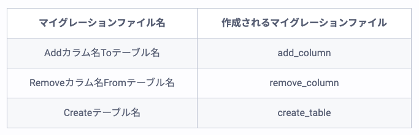

## 知識確認テストの復習(rails問21まで)  
### Railsにおける命名規則について(問1〜3)  
1.参考  
[Railsにおける命名規則](https://qiita.com/gakkie/items/3afcd505c786364aa5fa)  
2.内容  
| 項目                         | 命名規則                     | 例                              |
| ---------------------------- | ---------------------------- | ------------------------------- |
| ■コントローラ               |                              |                                 |
| ▼単一単語                  |                              |                                 |
| コントローラ名             | 先頭小文字・複数形           | items                           |
| コントローラクラス名       | 先頭大文字・キャメル・複数形 | ItemsController                 |
| ファイル名                 | 先頭小文字・スネーク・複数形 | items_controller.rb             |
| ▼複数単語                  |                              |                                 |
| コントローラ名             | 先頭小文字・スネーク・複数形 | sales_point                     |
| コントローラクラス名       | 先頭小文字・キャメル・複数形 | SalesPointController            |
| ファイル名                 | 先頭小文字・スネーク・複数形 | sales_point_controller.rb       |
| ■モデル                     |                              |                                 |
| ▼単一単語                  |                              |                                 |
| モデル名                   | 先頭小文字                   | user                            |
| モデルクラス名             | 先頭大文字・単数形           | User                            |
| ファイル名                 | 先頭小文字・単数形           | user.rb                         |
| テーブル名                 | 先頭小文字・複数形           | users                           |
| ▼複数単語                  |                              |                                 |
| モデル名                   | 先頭小文字                   | cancel reason                   |
| モデルクラス名             | 先頭大文字・キャメル・単数形 | CancelReason                    |
| ファイル名                 | 先頭小文字・スネーク・単数形 | cancel_reason.rb                |
| テーブル名                 | 先頭小文字・スネーク・複数形 | cancel_reasons                  |
| ■マイグレーションファイル   |                              |                                 |
| マイグレーションクラス名   | 先頭大文字・キャメル・複数形 | CreateUsers                    |
| マイグレーションファイル名 | 先頭小文字・スネーク・複数形 | xxxxxxxxxxxxxx_create_blogs.rb |


### find、find_by、whereの違い(問5〜6)  
1.参考  
[【Rails】find・find_by・whereについてまとめてみた](https://qiita.com/tsuchinoko_run/items/f3926caaec461cfa1ca3)  
2.内容  
■find  
主キーに対応するレコードを取り出す。
```
#主キー(id)が1のbookを検索
> Book.find(1)
```  

■find_by  
①与えられた条件にマッチするレコードのうち最初のレコードだけを返す。  
```
Book.find_by(title: "test")
=> #<Book:0x007fb51b0ba748
```
②条件に一致するものがない場合はnilを返す。findは例外を返す！  
```
Book.find_by(title: "rails")
=> nil
```  

■where  
与えられた条件にマッチするレコードをすべて返す。  
注意）取得したデータから特定カラムのデータを取得することはできない！！！(@book.nameなど)
```
Book.where(title: "test")
=> [#<Book:0x007f978ebe0960
  id: 2,
  title: "test",
  price: 960,
  publish: "test",
  created_at: Sat, 05 May 2018 05:58:20 UTC +00:00,
  updated_at: Sat, 05 May 2018 05:58:20 UTC +00:00>,
 #<Book:0x007f978ebe0780
  id: 10,
  title: "test",
  price: 800,
  publish: "fuga",
  created_at: Mon, 17 Sep 2018 15:30:55 UTC +00:00,
  updated_at: Mon, 17 Sep 2018 15:30:55 UTC +00:00>]
```


### createメソッドについて(問8)  
1.参考  
[Railsのcreateメソッドは保存に成功しても、失敗してもモデルオブジェクトを返す](https://qiita.com/shiinoaya/items/dbaca7126d515dc46fc1)  
2.内容  
createメソッドはnew+saveの機能があるが、保存に成功しても、失敗してもモデルオブジェクトを返す。(if文を使う時には注意！)  
```
# 保存成功
User.create(name: "testuser")
=> #<User id: 1, name: "testuser", created_at: "2019-11-03 14:22:46", updated_at: "2019-11-03 14:22:46"> 

# 保存失敗 
User.create(name: nil)
=> #<User id: nil, name: nil, created_at: nil, updated_at: nil> 
```

### rails db:resetとrails db:migration:resetの違い(問9)  
1.参考  
[rails db:migrate:resetできなかったのでrails db:resetした](https://qiita.com/mom0tomo/items/a252ff8a42eea00f81b1)  
2.内容  
■rails db:resetについて  
db/schema.rbを元にDB再度作成する。(マイグレーションファイルは使わない)  

■rails db:migrate:resetについて  
マイグレーションファイルを元にDB再度作成する。


### マイグレーション名のパターンについて(問13)  
1.参考  
[【Rails】マイグレーションファイルを徹底解説！](https://pikawaka.com/rails/migration)  
2.内容  
以下規則のマグレーションファイル名を指定するとコードが書かれた状態でファイルを作成できる。  
  


### マグレーションファイルのchange/up・downの使い分けについて(問14)  
1.参考  
[migrationでrollback可否でchangeかup/downを使い分ける](https://qiita.com/koni4k/items/294342048cb6d47bcc3f)  
2.内容  
■changeでOK  
①カラム追加  
②カラム名前変更  
③カラムにindexを追加  
④カラムにデフォルト値を設定  

■up・downの記述が必要  
①カラムのデータ型を変更  
②カラムにnullを許可しないよう変更  
③カラムにデフォルト値を設定  


### new_record?、valid?メソッドについて(問16)  
1.参考  
[active recordのnew_record?とpersisted?の違い](https://zwzw.hatenablog.com/entry/new_record-vs-persisted)  
[【Rails】完全解説！Railsのバリデーションの使い方をマスターしよう！](https://pikawaka.com/rails/validation)  
2.内容  
■new_record?メソッド  
newメソッドで新しくオブジェクトを作成しているが、saveメソッドでデータベースのテーブルに保存されていない場合は`true`になる。  

■valid?メソッド  
newメソッドで新しくオブジェクトを作成し、saveメソッドで保存できる状態(バリデーションにかからない)であれば`true`となる。(invalid?は逆！)  


### .errors.messagesメソッドについて(問17)  
1.参考  
[Railsガイド](https://railsguides.jp/active_record_validations.html)  
2.内容  
Active Recordでバリデーションが行われた後は、errors.messagesインスタンスメソッドを使うと、発生したエラーにアクセスできる。  
※createやsaveメソッドなどでバリデーションが実行されたタイミングで入る。


### uniqueness: trueとonオプションについて(問18関連)  
1.参考  
[Railsガイド](https://railsguides.jp/active_record_validations.html)  
2.内容  
以下のようにアクションごとにユニーク制限をかけることもできる。  
```
# 値が重複していてもemailを更新できる
validates :email, uniqueness: true, on: :create
```


### has_oneアソシエーションの関連リソース作成について(問21)  
1.参考  
[Railsガイド](https://railsguides.jp/association_basics.html#has-one%E9%96%A2%E9%80%A3%E4%BB%98%E3%81%91%E3%81%AE%E8%A9%B3%E7%B4%B0)  
2.内容  
has_manyの際は` parent.hoges.create(~~~)`でOKだが、has_oneの際は`parent.create_hoge(~~~)`とする必要がある。

