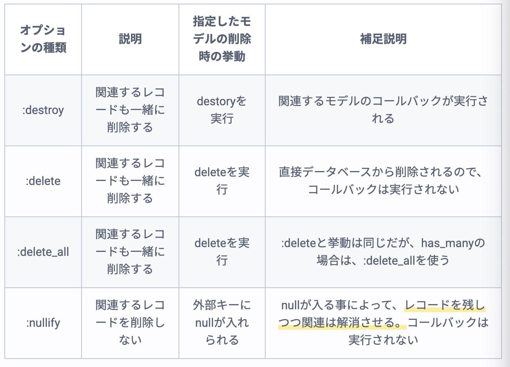
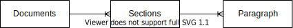
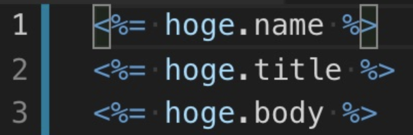

## 知識確認テストの復習(問22〜)  
### 1対多のオプション、データ作成について(問22)  
1.参考  
[【Rails】アソシエーションを図解形式で徹底的に理解しよう！](https://pikawaka.com/rails/association)  
2.内容  
■dependentオプションについて  
親モデルを削除する時に関連付けされている子モデルの挙動を決めるオプション。(1側のモデルに定義をする)  
  

■optionalオプションについて  
外部キーのnilを許可するオプション。(多側のモデルに定義)  

■データ作成  
以下の3つは同じ意味になる。(どれもcurrent_userのidをarticlesテーブルの外部キーとしてデータを作成する)  
```
①current_user.articles.create

②Article.create(user_id: current_user.id)

③Article.create(user: current_user)
```


## throughオプションを使用したアソシエーションについて(問23)  
1.参考  
[【Rails】アソシエーションを図解形式で徹底的に理解しよう！](https://pikawaka.com/rails/association)  
2.内容  
①前提の関係性  
  
②モデルのアソシエーションの定義  
```
class Document < ApplicationRecord
  has_many :sections
  has_many :paragraphs, through: :sections
end

class Section < ApplicationRecord
  belongs_to :document
  has_many :paragraphs
end

class Paragraph < ApplicationRecord
  belongs_to :section
end

class Document < ApplicationRecord
  belongs_to :sections
  belongs_to :paragraphs, through: :sections
end
```
③できるようになること  
Documentオブジェクト.sections、Documentオブジェクト.paragraphsでDocumentオブジェクトに関連するsections、paragraphsを取得することできる。  


## belong_toアソシエーションについて(問25)  
1.参考  
[Railsガイド](https://railsguides.jp/association_basics.html#belongs-to%E9%96%A2%E9%80%A3%E4%BB%98%E3%81%91)  
2.内容  
1側のインスタンスで以下のようなメソッドが使用可能になる。  
```
# 具体例用のモデル  
class Book < ApplicationRecord
  belongs_to :author
end
```
①@author = @book.author  
@bookインスタンスに関連付けをしたauthorの内容を返す。  
②@book.author = @author  
@bookインスタンスを@authorと関連付けをさせる。  
③@author = @book.create_author(author_number: 123,author_name: "John Doe")  
関連付けられた型の新しいオブジェクトを返す。  
※create_authorとなるところに注意！(author.createではない！！)  


## パーシャルについて(問26)  
1.参考  
[パーシャル(部分テンプレート)へローカル変数を渡したいとき](https://qiita.com/takannporo/items/a8ff93109afc3bc3bab4)  
[【Rails】部分テンプレートの使い方を徹底解説！](https://pikawaka.com/rails/partial_template)   
2.内容  
■localsオプション  
パーシャルに対して外から変数を渡すには、localsオプションを使用するが、`locals:`は省略ができる。注意点として`partial:`も一緒に省略する必要がある。  

■collectionオプション  
```
<% @hoges.each do |hoge| %>
  <%= hoge.name %>
  <%= hoge.title %> 
  <%= hoge.body %>
<% end %>
```
上記のようなviewファイルをcollectionオプションを使うことで、共通化できる。 
```
# _hoge.html.erb

```
```
# ビューファイル  
<%= render partial: 'hoge', collection: @hoges %>
```


## ルーティングについて  
1.参考  
[Rails ルーティング 基礎 まとめ](https://qiita.com/akk11_k/items/a6a21beb2b736ebbc147)  
2.内容  
■基礎系  
httpリクエスト、URL、コントローラ名#アクション名を記載する。  
```
Rails.application.routes.draw do
  root "tweets#index"
  get  "tweets/new"  => "tweets#new"
  post "tweets"      => "tweets#create"
end
```

■resources  
以下のルーティンが自動で作成される。  
```
Prefix   Verb   URI Pattern                 Controller#Action
    tweets   GET    /tweets(.:format)           tweets#index
             POST   /tweets(.:format)           tweets#create
 new_tweet   GET    /tweets/new(.:format)       tweets#new
edit_tweet   GET    /tweets/:id/edit(.:format)  tweets#edit
     tweet   GET    /tweets/:id(.:format)       tweets#show
             PATCH  /tweets/:id(.:format)       tweets#update
             PUT    /tweets/:id(.:format)       tweets#update
             DELETE /tweets/:id(.:format)       tweets#destroy
```  

■resource  
esourcesのindexアクションがなし、URI Patternにidが含まれなくなる。(ユーザーのプロフィールなどidを参照する必要がない場合に使用)  
```
     Prefix   Verb   URI Pattern            Controller#Action
  new_tweet   GET    /tweet/new(.:format)   tweets#new
 edit_tweet   GET    /tweet/edit(.:format)  tweets#edit
      tweet   GET    /tweet(.:format)       tweets#show
              PATCH  /tweet(.:format)       tweets#update
              PUT    /tweet(.:format)       tweets#update
              DELETE /tweet(.:format)       tweets#destroy
              POST   /tweet(.:format)       tweets#create
```

■ルーティングをネスト  
どのcontentに対してのcommentであるかなどを紐付ける必要がある際に使用する。  
```
//抜粋
content_comments  POST  /contents/:content_id/comments(.:format)    comments#create
```
※:content_idと表記された値はparams[:content_id]で取得することが可能。