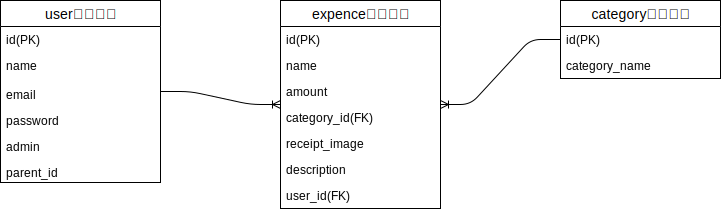

## 現場rails(アプリ作成)  
### 設計書(適宜修正の可能性あり)  
■アプリ前提  
現場Railsに記載範囲の技術を使用してアウトプット用のアプリを作成する。  

■アプリ名  
子供のお小遣い管理アプリ(pocket money app)  

■機能概要  
子供がお小遣いの支出をアプリに登録して、親が使い道の確認をする。

■利用手順  
1.管理者(親想定)がユーザー(子供想定)のアカウントを作成する。  
2.ユーザーはログインをして支出を登録する。  
※登録項目は「支出名、支出金額、支出種類、レシート画像、詳細」  
3.管理者のページには、作成したユーザーの支出が確認できるようにする。   

■備考  
1.itemテーブルには今回はユーザーが追加、編集できる機能は実装せず、支出種類(食費、洋服、交際費など)を事前に登録しておく。  
2.各ユーザー同士では支出内容が表示されないようにする。  

■ER図  

■エンドポイント表  
| No. | やりたいこと               | HTTP動詞    | URIパターン            | Controller#Action     |
| --- | -------------------- | --------- | ------------------ | --------------------- |
| 1   | 支出一覧を表示する(表示)        | GET       | /expences          | expences#index        |
| 2   | 支出詳細を表示する(表示)        | GET       | /expences/:id      | expences#show         |
| 3   | 支出の新規登録画面を表示する(表示)   | GET       | /expences/new      | expences#new          |
| 4   | 支出を新規登録する(動作)        | POST      | /expences          | expences#create       |
| 5   | 支出の編集画面を表示する(表示)     | GET       | /expences/:id/edit | expences#edit         |
| 6   | 支出を更新する(動作)          | PUT/PATCH | /expences/:id      | expences#update       |
| 7   | 支出を削除する(動作)          | DELETE    | /expences/:id      | expences#destroy      |
| 8   | ユーザー一覧を表示する(表示)      | GET       | /users             | users#index           |
| 9   | ユーザー詳細を表示する(表示)      | GET       | /users/:id         | users#show            |
| 10  | ユーザーの新規登録画面を表示する(表示) | GET       | /users/new         | users#new             |
| 11  | ユーザーを新規登録する(動作)      | POST      | /users             | users#create          |
| 12  | ユーザーの編集画面を表示する(表示)   | GET       | /users/:id/edit    | users#edit            |
| 13  | ユーザーを更新する(動作)        | PUT/PATCH | /users/:id         | users#update          |
| 14  | ユーザーを削除する(動作)        | DELETE    | /users/:id         | users#destroy         |
| 15  | ログインのフォームを表示する(表示)   | GET       | /user_sessions/new | user_sessions#new     |
| 16  | ログインを行う(動作)          | POST      | /user_sessions     | user_sessions#create  |
| 17  | ログアウトを行う(動作)         | DELETE    | /logout            | user_sessions#destroy |