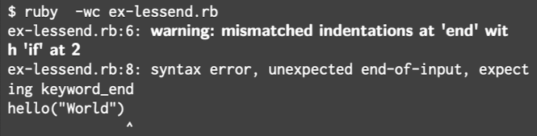
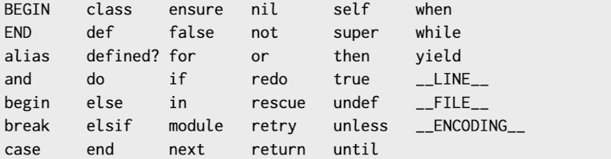
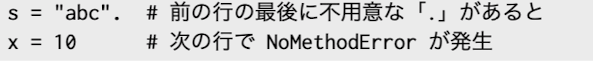

# Rubyのエラーメッセージが読み解けるようになる本  
## Rubyプログラムの実行について  
1.構文解析:プログラムの構文を解析する。  
2.コード生成:解析結果をもとにバイトコードを生成する。  
3.コード実行:バイトコードを仮想マシンで実行する。  
「1」の構文解析で起こるエラーを「構文エラー」(Syntax Error)、「2」の コード実行で起こるエラーを「実行時エラー」(Runtime Error)という。  

## 構文エラー (SyntaxError)について  
(エラーメッセージは状況によって差異が出るため参考程度)  
### endが足りない  
1.エラーメッセージ  
syntax error, unexpected end-of-input,expecting keyword_end  
2.対策  
「-wc」オプションを付けて実行すると以下ようにインデントで判断して警告を出してくれる。  

### endが多すぎる  
1.エラーメッセージ  
syntax error, unexpected keyword_end, expecting end-of-input  

### elsifをeles ifと書いている  
1.エラーメッセージ  
syntax error, unexpected end-of-input, expecting end  

### 予約語をローカル変数名に使っている  
1.エラーメッセージ  
syntax error, unexpected ’=’, expecting keyword_end  
2.対策  
以下の予約語を覚える。  
  
※先頭に@がつくインスタンス変数やメソッド名では使用可能！  

### 文字列のリテラルが閉じてない  
1.エラーメッセージ  
unterminated string meets end of file  

### 文字列リテラルが途中で閉じている  
1.エラーメッセージ  
syntax error, unexpected tIDENTIFIER, expecting end-of-input  

### 条件演算子のまわりに空白がない  
1.エラーメッセージ  
syntax error, unexpected tIDENTIFIER  
2.対策  
条件演算子として認識させるには空白を入れる必要がある。  

### 数字始まりの名前を使用している  
1.エラーメッセージ  
unexpected tIDENTIFIER, expecting end-of-input  

## NoMethodErrorについて  
呼び出したメソッドがレシーバオブジェクトに存在していないと出るエラー
### メソッド名のつづりを間違えている  
1.エラー内容  
undefined method ‘lenght’ for "abc":String  
2.対策  
String クラスのオブジェクト"abc"には、lenght()というメソッドはない！という意味なので、直後に出るヒントなどにしたがってつづりを修正する。  

### レシーバオブジェクトが nil である  
1.エラー内容  
undefined method ‘length’ for nil:NilClass (NoMethodError)  
2.対策  
Rubyではnilもオブジェクトとなるため、ぼっち演算子などを使うことで例外を回避する。  

### 予約後のつづりを間違えている  
1.エラー内容  
undefined method ‘retrun’  
※NameErrorのエラーが発生する可能性もある。  

### プライベートメソッドを呼び出している  
1.エラー内容  
private method ‘user’ called for # Hello:....  
2.対策  
Rubyでは、privateメソッドではレシーバオブジェクトなしでしか呼び出すことはできない。  

### 前の行の最後に「.」がついている  
1.エラー内容  
NoMethodError  
2.対策  
以下のように最後の行に「.」がついていた場合、次の行と連結させて`"abc".x = 10`という内容だと解釈されてしまう。  

