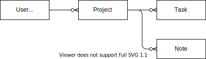

# everydayrails(P57~)  
### 異なるメールアドレスでテストデータを作成したい場合  
以下のようにシーケンスを使用することでユニークになる必要がある属性を登録することができる。  
```
# spec/factories/users.rb

FactoryBot.define do 
  factory :user do
    first_name "Aaron"
    last_name "Sumner"
    sequence(:email) { |n| "tester#{n}@example.com" } 
    password "dottle-nouveau-pavilion-tights-furze"
  end 
end
```

### 他のモデルと関連を持つモデルの登録をしたい場合  
■前提  


■方法  
1.`spec/factories/notes.rb`にテスト情報・関連を定義する。  
```
FactoryBot.define do 
  factory :note do
    message "My important note." 
    association :project 
    association :user
  end   
end
```

2.`spec/factories/projects.rb`にもテスト情報・関連を定義する。  
```
FactoryBot.define do 
  factory :project do
    sequence(:name) { |n| "Project #{n}" } 
    description "A test project."
    due_on 1.week.from_now
    association :owner
  end 
end
```

3.`spec/factories/users.rb`にテスト情報を定義する。(aliasesに注意！)  
```
FactoryBot.define do
  factory :user, aliases: [:owner] do
    first_name "Aaron"
    last_name "Sumner"
    sequence(:email) { |n| "tester#{n}@example.com" } 
    password "dottle-nouveau-pavilion-tights-furze"
  end 
end
```
4.このままではテストユーザーが2名分作られてしまうため、`spec/factories/notes.rb`を以下に書き換える。  
```
FactoryBot.define do 
  factory :note do
    message "My important note." 
    association :project
    user { project.owner }
  end 
end
```

## 第5章  
コントローラースペックについて  
### コントローラースペックの基本  
①ジェネレーターで定型コードを作成する。  
` bin/rails g rspec:controller home`と打つと以下が生成される。  
```
require 'rails_helper'
RSpec.describe HomeController, type: :controller do
end
```
②テストの中身を記載する。  
以下の場合は、`expect(response).to be_success`でレスポンスステータスが成功かどうかをテストしている。  
```
require 'rails_helper'

RSpec.describe HomeController, type: :controller do 
  describe "#index" do
    # 正常にレスポンスを返すこと 
    it "responds successfully" do
      get :index
      expect(response).to be_success 
      # expect(response).to have_http_status "200" も同じ内容のテストになる！！
    end
  end 
end
```