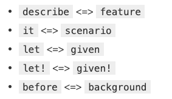

# everydayrails(P98~)  
## 第6章  
フィーチャスペックでUIをテストする。  
フィーチャスペックとは、統合テストやシステムテストなどと同義。（結合テストの次の段階）  

### 設定方法  
1.ブラウザーからシュミレートをするため`capybara`のgemをインスールする。(Rails 5.1以上の場合はインストール不要)  
2.`rails_helper`にCapybara のライブラリを追加をする。  


### 使用方法  
1.`rails generate rspec:feature projects`でファイルを作成する。  
■具体例  
2.ファイルの中にテストを記載していく。  
```
require 'rails_helper' 

RSpec.feature "Projects", type: :feature do
  # ユーザーは新しいプロジェクトを作成する
  scenario "user creates a new project" do
  user = FactoryBot.create(:user)

  visit root_path
  click_link "Sign in"
  fill_in "Email", with: user.email
  fill_in "Password", with: user.password
  click_button "Log in"

  expect {
  click_link "New Project"
  fill_in "Name", with: "Test Project"
  fill_in "Description", with: "Trying out Capybara"
  click_button "Create Project"

  expect(page).to have_content "Project was successfully created"
  expect(page).to have_content "Test Project"
  expect(page).to have_content "Owner: #{user.name}"
  }.to change(user.projects, :count).by(1) 
  end
end
```
■解説  
①テスト前提  
アプリケーションの利用者が使うものとまったく同じWebフォームを使って新しいプロジェクトを作成している。(コントローラースペックではUI関係なく直接コントローラーにデータを渡している。)  

②scenarioとは？？  
describeやitのエイリアスらしい。(参考:[使えるRSpec入門・その4「どんなブラウザ操作も自由自在！逆引きCapybara大辞典」](https://qiita.com/jnchito/items/607f956263c38a5fec24))
【対応表】  
  

③expect{}のネストについて  
change マッチャを使って「ユーザーがオ ーナーになっているプロジェクトが本当に増えたかどうか」をテストしている。  