# everydayrails(P112~)  
## 第8章  
スペックをDRYに保つ(DRYすぎるのもよくないらしい)  

### サポートモジュール  
ユーザーがアプリにログインをするなどの重複ステップがある場合、サポートモジュールを使用することでDRYにコードを記述することができる。  
①サポートモジュールの定義方法  
```
# spec/support/login_support.rb  

module LoginSupport
  def sign_in_as(user)
  visit root_path
  click_link "Sign in"
  fill_in "Email", with: user.email
  fill_in "Password", with: user.password
  click_button "Log in"
  end
end

# specごとにincludeをすることも可能
RSpec.configure do |config|
  config.include LoginSupport
end
```

②サポートモジュールの使用方法  
```
RSpec.feature "Projects", type: :feature do
  # ユーザーは新しいプロジェクトを作成する 
  scenario "user creates a new project" do
    user = FactoryBot.create(:user) 
    # インクルードしたサポートモジュールを呼び出す  
    sign_in_as user
```

### let、let!を使用する  
beforeブロックに処理を記載することで、共通のインスタンス変数をセットアップすることができるが、describeやcontextの内部に書いたテストを実行するたびに毎回実行される&要件が増えるとテストの可読性が悪くなるなどの問題点があるのでlet,let!を使用する。  

■使いわけの基準  
[rspec-style-guide](https://qian-dao-zhen-yi.gitbook.io/rspec-style-guide/)  


【遅延評価で問題があるケースとは？？】  
■例文  
```
describe 'let' do
  let(:user) { create(:user) }
  let(:user_article) { create(:article, user_id: user.id) }

  specify 'User が Article を持っていること' do
    expect(user.articles.first).to eq user_article
  end
end
```
■解説  
上記の場合は、`let(:user_article) { create(:article, user_id: user.id) }`が呼ばれるのは`user_article`を使用する`expect(user.articles.first).to eq user_article`のeqの後のなので、`user.articles.first`でエラーになってしまう。  