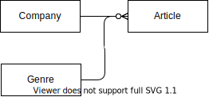

# RSpecビギナーズ!! vol.1
## URL  
[【動画公開】RSpec初心者向けのオンライン勉強会を開いてみた （RSpecビギナーズ!! vol.1）](https://blog.jnito.com/entry/2020/08/31/072556)

## 内容  
### 関連モデルのテストについて  
■概要  
user(1)対post(多)の定義をしているモデルテストをどのように記載すればいいか。  

■解答  
特に特殊な設定をしてない関連のテストはしない。railsの機能を利用しているため不具合の可能性が少ないため。  
ただ例外として関連名を変えているなどの際には、以下の方法にて関連のテストをする。  
```
user = User.new(email:'xxx@example.com')
user.postws.create!(title: 'こんにちは')
user.reload
expect(user.posts.count).tp eq 1
expect(user.posts.first.title).to 'こんにちは'
```

### type: :modelについて  
■概要  
RSpec.descrice User type: :model doの`type: :model`が必要かについて。  

■解説  
rails_helper.rbの`config.infer_spec_type_file_location!`という記述があるとスペックのファイル名よりどの種類のスペックがどうかなどを判断してくれるため、不要だが通常記載する。  


### モデルのテストについて  
■概要  
以下のリレーションがある際にarticle(記事)が正しく保存できるかのテストをしたい。  
【リレーション】  
  

■解説  
【やらない方がいいこと】  
①IDを自分で作成をしない。(id: 2でテストケースを作るなどはしない方がいい！)  
②create_at,update_atの作成も不要。  


### テスト駆動開発の回し方について 
■概要  
テスト駆動開発をする場合はどのぐらいの単位でテストを書くべきか。（モデル作成ごと？）  

■解説  
前提としてテストに慣れていない場合は、テスト駆動開発でなくプログラムを書いてからで良い。  
テスト駆動を行う場合は、機能単位でテストを書くことが多い。(ブランチは分けない)  


### System Specを使う時のイメージについて  
■概要  
System Specを書くイメージ理由がよくわからない  

■解説  
System Specはブラウザで動かした時のテストができる（コントローラー、ビュー、モデルを一括テストできる）  

■capibaraの便利ツール  
[nezumi](https://github.com/mugi-uno/nezumi)  
※ブラウザでやったことがテストコードになる。  

