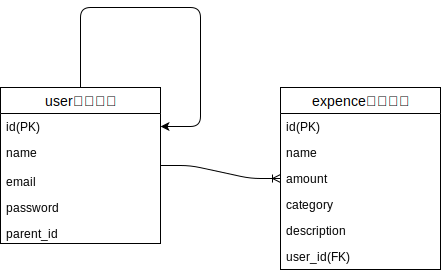

# アウトプット中のメモ  
## FactoryBotのインスタンス作成について
newは使用できないで、buildを使用する必要がある。  
```
#以下はNG
FactoryBot.new(:user)

# 以下はOK
FactoryBot.build(:user)
```

## FactoryBotでの関連の使い方について  
■前提テーブル・モデル条件  
   
```
# Userモデル  
class User < ApplicationRecord
  has_secure_password

  validates :name, presence: true
  validates :email, presence: true, uniqueness: true

  has_many :expences, dependent: :destroy

  # 自己結合を定義
  has_many :children, class_name: 'User', foreign_key: 'parent_id', dependent: :destroy
  belongs_to :parent, class_name: 'User', optional: true
end
```

■やりたいこと  
自己結合をしているUserモデルで親権者アカウントから子供アカウントをFactoryBotで生成したい。  

■STEP1  
1側のfactory(子供アカウント)に多側(親権者アカウント)assciationを定義する。  
```
# spec/factories/user.rb

  factory :child_user, class: User, aliases: [:child] do
    name {'テスト 子太郎'}
    email {'kotaro@example.com'}
    password {'test_password'}
    association :parent
  end
```
※factoryの名前とクラス名が異なる場合は、`class: User`でクラスを指定する必要がある。  

■STEP2  
多側のfactory(親権者アカウント)にalisasesを定義する。(Userモデルで`parent`という名前を付けているため)  
```
# spec/factories/user.rb

factory :parent_user, class: User, aliases: [:parent] do
  name {'テスト 親一郎'}
  email {'tester@example.com'}
  password {'test_password'}
end
```

■結果確認  
`inspect`メソッドを使うことでコンソール上で中身を確認することができる。  
```
  describe '親権者アカウントから子供アカウントの作成ができるいるかのテスト' do
    it '親権者アカウントから子供アカウントを生成する' do
      child_user = FactoryBot.create(:child_user)
      puts "子供アカウントは#{child_user.inspect}"
      puts "親アカウントは#{child_user.parent.inspect}"
    end
  end
```

```
# コンソールの内容  
  親権者アカウントから子供アカウントの作成ができるいるかのテスト
子供アカウントは#<User id: 200, name: "テスト 子太郎", email: "kotaro@example.com", password_digest: "$2a$04$AD4kQvrody2l94N05v0hHOGgJnDE.sVrckRAwT8Lkht...", created_at: "2020-09-16 15:14:48", updated_at: "2020-09-16 15:14:48", parent_id: 199>
親アカウントは#<User id: 199, name: "テスト 親一郎", email: "tester@example.com", password_digest: "$2a$04$21GzJEBF.v33F1Gwnh1gD.RZeSdYy6dg8X9D175uxpj...", created_at: "2020-09-16 15:14:48", updated_at: "2020-09-16 15:14:48", parent_id: nil>
```