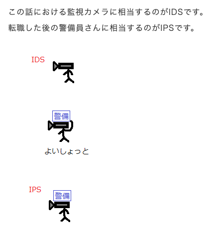

## ポートスキャンとは？？  
いろんなポートに片っ端から接続してみて、開いているポートを調べること  
(ファイアーウォールで防御可能)  

## WAFとは？？(Webアプリケーションファイアーウォール)  
ファイアーウォールは、クライアント送受信を守る。  
WAFは、webサーバの送受信を守る。 

## WPAとは？？(Wi-Fi Protected Access)  
WEPより進化をしたwifiを守る仕組み。  
※AES(共通鍵暗号方式)で実現を行う。  

## IDS、IPSとは？？  
  

## SIEMとは？？  
進化したログ管理システム  
