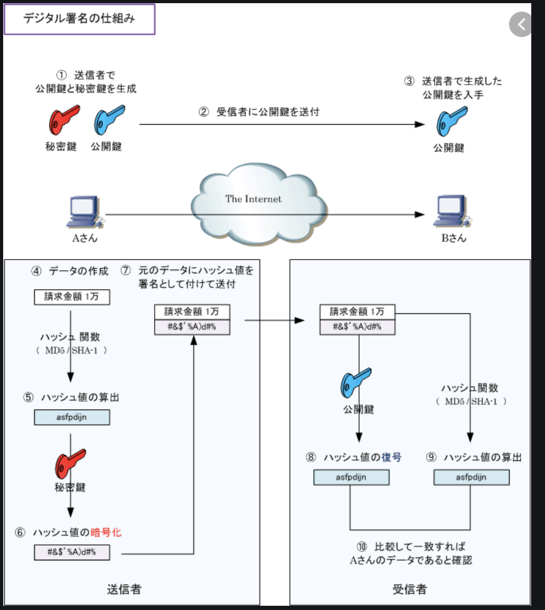
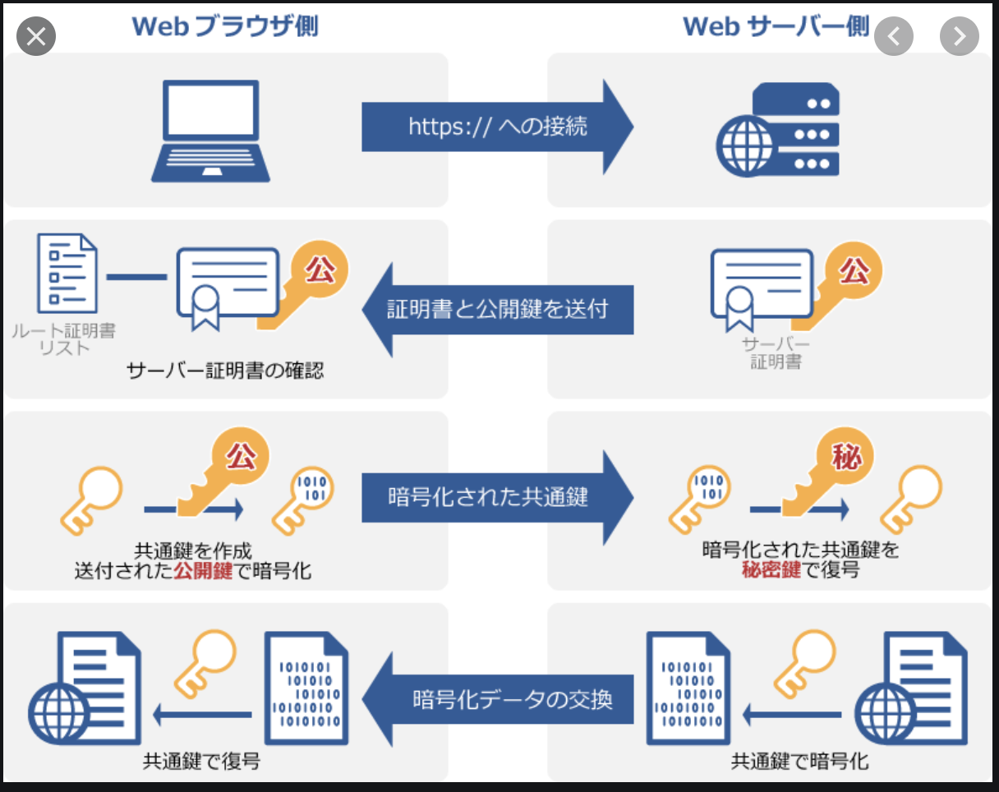
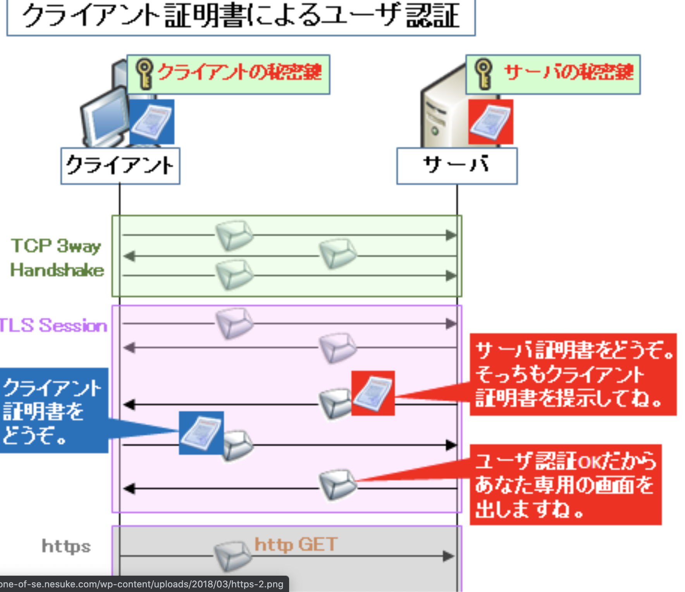
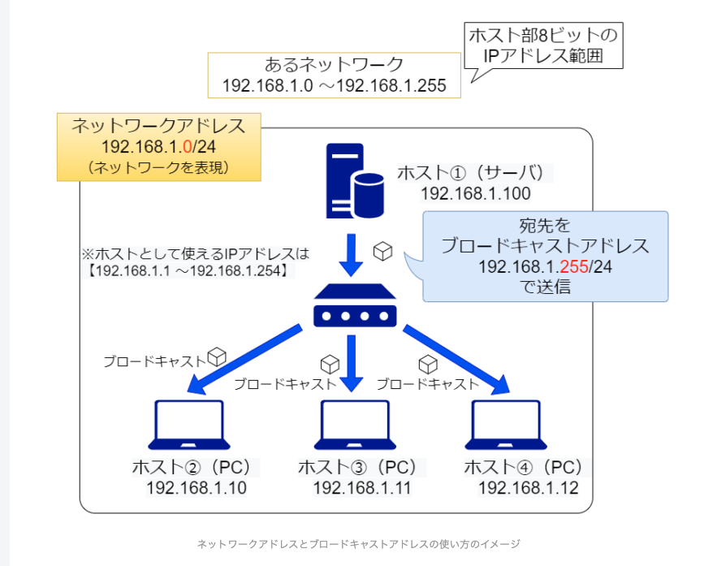
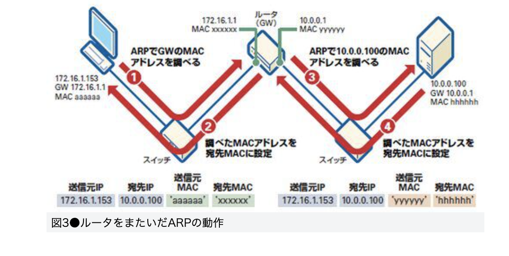

## ポートスキャンとは？？  
いろんなポートに片っ端から接続してみて、開いているポートを調べること  
(ファイアーウォールで防御可能)  

## WAFとは？？(Webアプリケーションファイアーウォール)  
ファイアーウォールは、クライアント送受信を守る。  
WAFは、webサーバの送受信を守る(IPアドレス・ポート番号だけでなく、データの中身まで確認をする)。  
※SQLインジェクション、

## WPAとは？？(Wi-Fi Protected Access)  
WEPより進化をしたwifiを守る仕組み。  
※AES(共通鍵暗号方式)で実現を行う。  

## IDS、IPSとは？？  
  

## SIEMとは？？  
進化したログ管理システム  

## デジタル署名  
  
※TLS/SSLとは逆の使い方！！  

## SSL/TLS  
  

## クライアント証明書  
  
※ID,Pass不要で認証ができる。  

## リバースプロキシサーバーとは？？  
Webサーバさん用代理交渉人のこと。  
※通常のプロキシサーバーはクライアントの代理交渉人。  
【メリット】  
(1)．身元を隠せる  
(2)．負荷分散ができる  

## オープンリレーとは？？  
誰からのメールも自由に転送するメールサーバーを使った方法  

## 単行演算子とは？？  
「1 + 2」の「+」のこと。「1」、「2」は非演算子(オペラント)と呼ぶ。  

## スケールアウト  
サーバーを増やして処理能力をアップすること  
※スケールアップはサーバー自体の能力を増やすこと！！  

## L2スイッチ、L3スイッチ、ルーターの違い  
■L2スイッチ  
同一のハブにつながっているMACアドレスを指定して通信できる(VLAN間での通信はできない)  

■L3スイッチ  
2スイッチの機能に加え、「IPアドレスを利用したルーティング機能」もある。(VLAN間での通信も可能)  
※l3スイッチには、ローカルIPアドレスが複数振られる(通常は192.168.1.1/24などの)  

■ルーター  
L3スイッチの遅い版(ソフトウェアでルーティングがされているため)  

## VLANとは？？  
元々のネットワークを論理的に区切ったりまとめたりしたネットワーク  

## ネットワークアドレス、ブロードキャストアドレスとは？？  
  
ビット全て0番はネットワーク自体をさし、ビット全て1番

## PCの通信方法  
【前提】  
PC、サーバー(ノード)ごとにIPアドレスが振られている  
【やること】  
宛先のネットワークアドレスが同一？別物？を判断する。  
①同一の場合は、自分で直接配送(arpしてmacアドレスを調べる)  
②別物の場合は、ルータに渡す  
※判断方法は以下となる。  
・自分のIPアドレス AND演算 自分のサブネットマスク値  
・宛先のIPアドレス AND演算 自分のサブネットマスク値  
上記が一致するかどうかで同一ネットワークいるか判断をする。  

## スイッチを環状にする問題点  
ブロードキャストフレームが回り続けて、ブロードキャストストームが発生してしまうため、せきとめをするスパニングツリープロトコルが必要。  

## VRRPとは？？  
ルーターを冗長構成すること(マスタールーターとバックアップルーターで構成)  
仮想IP・MACアドレスを使うと常時はマスタールーター、トラブル時はバックアップルーターに繋ぐ。  

## 相手先のMACアドレスの確認方法  

上記のまずarpでルーターのmacアドレスをしてべてから、宛先のMACアドレスを調べる。
[参考](https://ascii.jp/elem/000/000/629/629331/)

