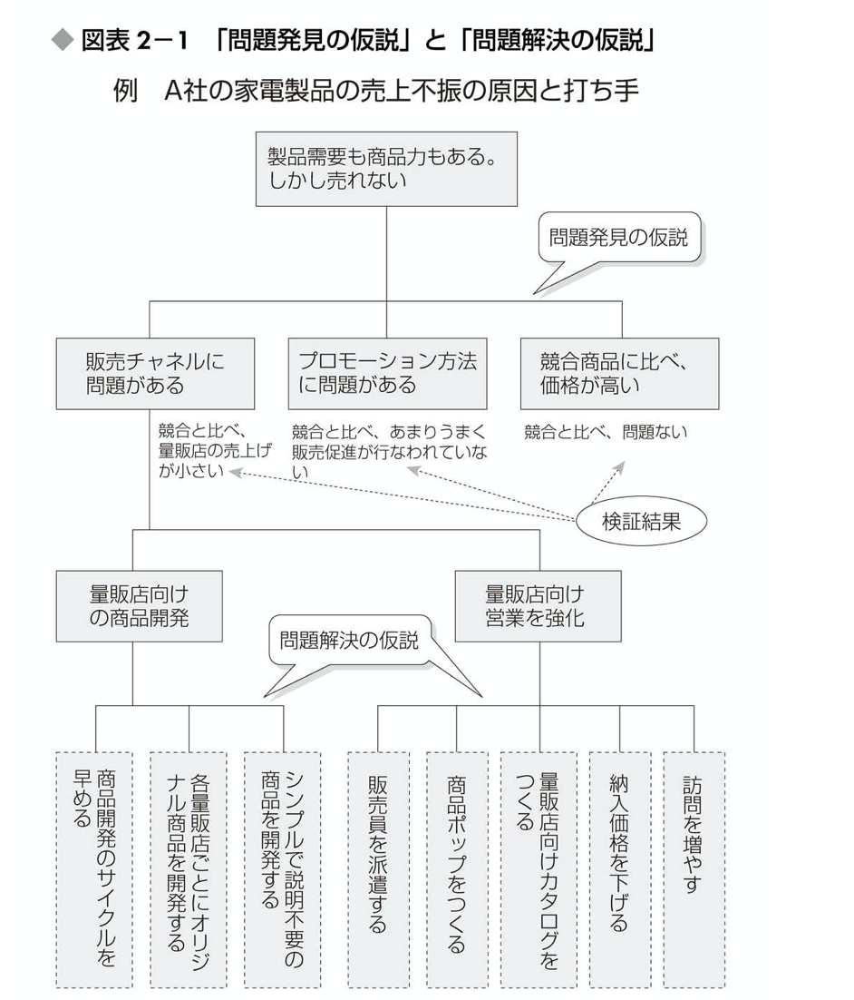

## 読書の目的  
仮説の方法を掴むために本書を読書しようと考えた。  

## 本の内容・感想  
■概要  
情報が多ければ（網羅的思考）意思決定ができるわけはない。  
→だから色々な情報を調べてもいまいちなのか...  

■仮説の種類  
▼STEP1  
問題発見の仮説  

▼SETP2  
問題解決の仮説  
  

■仮説の建て方  
①顧客・消費者の視点  
②現場の視点  
③競争相手の視点  

■ディスカッションのルール  
①必ず自分の仮説を立てていく  
②仮説を否定せずに進化を目指す  
③議論は負けるが勝ち  
④メンバーはバライティを豊かに  

だから何？だからどうする？を考える。  

・高決済だからって保険を使うわけではないのではないか？？
・法人関連の決済が多いのではないか？
・利用年数が多いのではないか？
