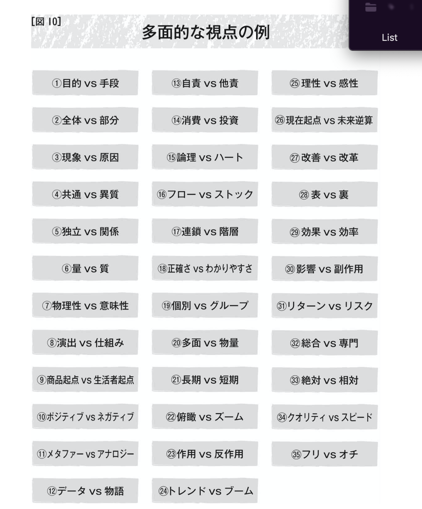
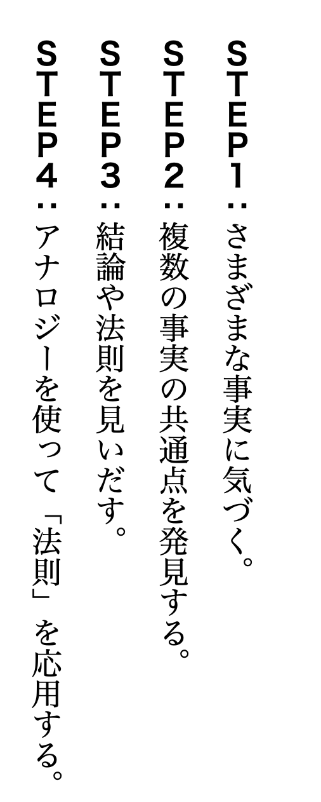

## 読書の目的  
現代版の仮説の建て方を確認するため。  

## 本の内容・感想  
■帰納法のコツ(洞察的帰納法)  
「抽象化」と「多角的な視点」を持つこと。  
「抽象化」とは「形のある実体」を手掛かりにしながらも、それに囚われることなく「形のない概念」に抜き出していくことを指す。  
「多面的な視点」とは、抽象化で得た「概念」をさまざまな視点で捉え直すことを指す。たとえば「水＝飲めるもの・洗えるもの・火を消すもの」などが挙げられる。  
  
  

【具体的な方法】  
①さまざまな事実に気づく  
帰納法は複数事実から共通点を発見して結論を導き出す推論法のため、事実に気づく以下の観察力が大切。  
・フォーカスを絞る  
・視点を持つ(変化の視点、比較の視点、フレームワークの視点)  
・当たり前を疑う  

②複数の事実の共通点を発見する  

③結論や法則を見いだす  

④アナロジーを使って「法則」を応用する  

【着眼点】  
①事実から見えない文脈を見抜く  
②事実から見えないレベル感を見抜く  
③事実から見えない関係性を見抜く  
④事実から見えない価値観を見抜く  
⑤事実から見えない感情を見抜く  
