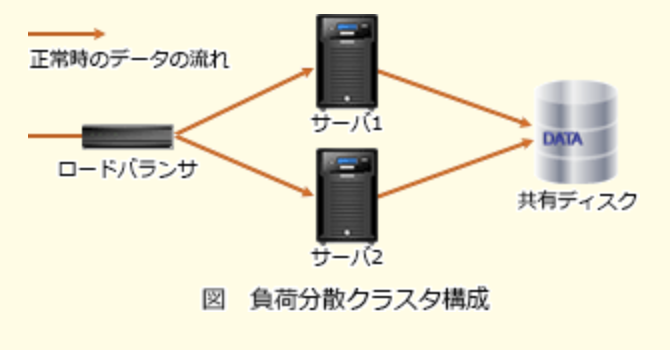
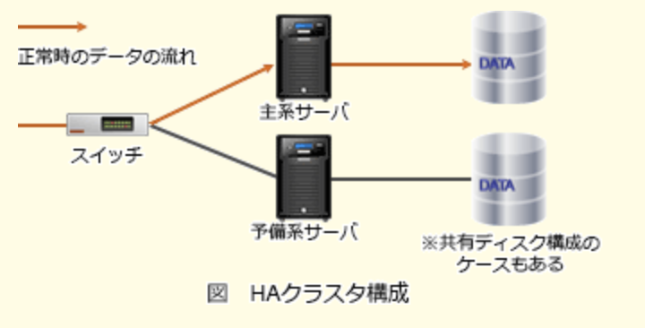

# FE勉強ノート  
- フォールトトレラントシステムとは？  
一部に故障が発生してもシステム全体としての必要な機能を維持させようとする考え方であり以下2種類に分類される。  
1.フェイルセーフ  
安全重視（止めるのもアリ）  
2.フェイルソフト  
動かし続けるの重視（機能・性能制限あり）  

- 負荷分散クラスタ構成  
処理を複数のサーバに分散することで、各サーバに掛かる負荷を低減させることを目的としたクラスタ構成。高い処理能力が求められるシステムでよく利用される。  
  

- HAクラスタ構成  
障害発生時も正常時と同様の処理を継続することを目的としたシステム。  
  

