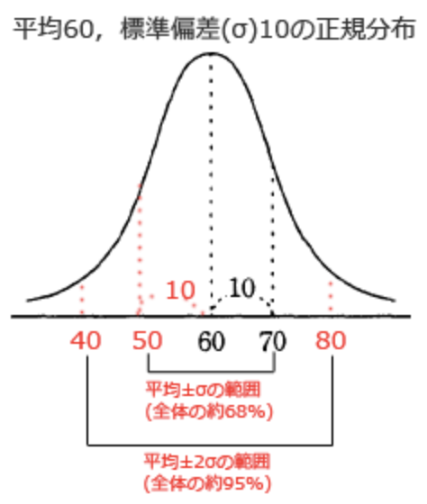

# FE勉強ノート  
## 正規分布の標準偏差について  
標準偏差をσとすると以下となる。  
・平均±σの範囲に全体の約68%が含まれる。 
・平均±2σの範囲に全体の約95%が含まれる。  
・平均±3σの範囲に全体の約99%が含まれる。  
  

## メモリインターリーブとは  
処理の早いCPUとCPUよりは遅いメモリの速度差を埋めるために、メモリを複数に分割をして、並列処理をさせる。  

