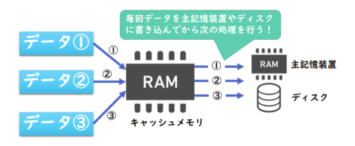
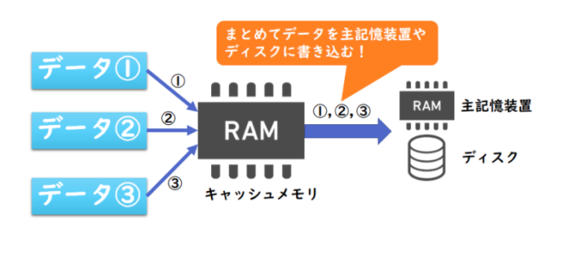

# FE勉強ノート  
- メモリインターリーブとは  
アナログをディジタルに変換にするには以下の手順となる。
1.標本化  
時間的に連続したアナログ信号(振幅、周波数、電圧など)を一定の時間間隔で測定する。  
2.量子化  
標本化で得られた数値を整数などの離散値で近似する。  
3.符号化  
量子化で得られた整数値を2進数のビットに対応付ける。

- ライトスルー、ライトバック方式とは  
1.ライトスルー方式  
  
2.ライトバック方式  
  